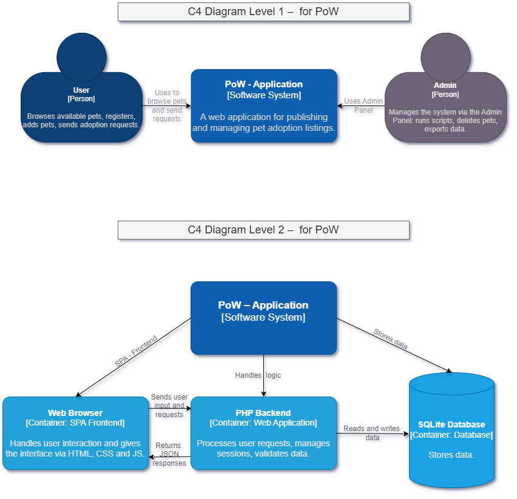
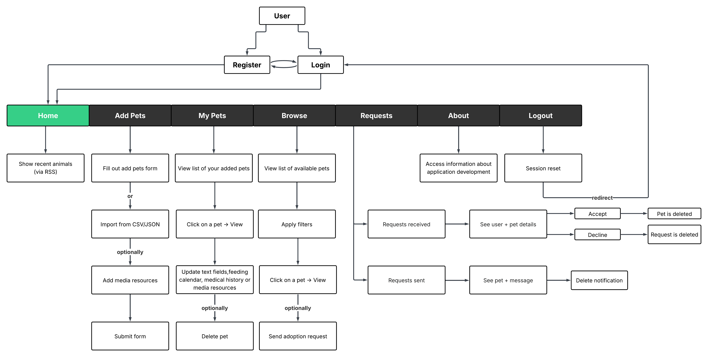

# PoW - Pet Adoption on Web
PoW is a SPA-type web application that manages the adoption of pets.

This README file is structured according to the IEEE Software Requirements Specification (SRS) template.
For a complete and improved version of the documentation, please see the `scholarly.html` file.

# Table of Contents

* [1. Introduction](#1-introduction)
  * 1.1 [Purpose](#11-purpose)
  * 1.2 [Document Conventions](#12-document-conventions)
  * 1.3 [Intended Audience and Reading Suggestions](#13-intended-audience-and-reading-suggestions)
  * 1.4 [Application Scope](#14-application-scope)
  * 1.5 [References](#15-references)
* [2. Overall Description](#2-overall-description)
  * 2.1 [Product Perspective](#21-product-perspective)
  * 2.2 [Product Functions](#22-product-functions)
  * 2.3 [Operating Environment](#23-operating-environment)
  * 2.4 [Design and Implementation Constraints](#24-design-and-implementation-constraints)
  * 2.5 [User Documentation](#25-user-documentation)
  * 2.6 [Assumptions and Dependencies](#26-assumptions-and-dependencies)
* [3. External Interface Requirements](#3-external-interface-requirements)
  * 3.1 [User Interfaces](#31-user-interfaces)
  * 3.2 [Software Interfaces](#32-software-interfaces)
* [4. System Features](#4-system-features)
  * 4.1 [Home](#41-home)
  * 4.2 [Register](#42-register)
  * 4.3 [Add Pet](#43-add-pet)
  * 4.4 [My Pets](#44-my-pets)
  * 4.5 [Browse Pets](#45-browse-pets)
  * 4.6 [Adoption Request](#46-adoption-request)
  * 4.7 [About](#47-about)
  * 4.8 [Admin Panel](#48-admin-panel)
* [5. Additional Information](#5-additional-information)
  * 5.1 [Technologies Used](#51-technologies-used)
  * 5.2 [Authors](#52-authors)
  * 5.3 [License](#53-license)

## 1. Introduction

### 1.1 Purpose

This document aims to describe the requirements and main functionalities of the PoW – Pet Adoption on Web web application.

The application was developed as part of an academic project and aims to facilitate the management and adoption of pets in a simple way, as well as the management of resources related to their care, through a user-friendly interface.

The document is aimed at people interested in understanding the structure, purpose and scope of the platform.

### 1.2 Document Conventions

This document follows a structured format inspired by the IEEE Software Requirements Specification (SRS). Sections and subsections are numbered to improve navigation and readability.

The following style guidelines are used consistently throughout:

- **Bold** is used to highlight important terms and system components (e.g., **PoW – Pet Adoption on Web**).
- *Italic* is used to clarify meanings.
- Monospace `code` is used for technical terms, file names, etc.

### 1.3 Intended Audience and Reading Suggestions

This document is intended for evaluators and students who wish to understand the functional and non-functional requirements of the PoW web application.

### 1.4 Application Scope

PoW (Pet Adoption on Web) is a single-page web application (SPA), developed to facilitate pet adoption in the online environment. Its purpose is to allow interaction between pet owners and potential adopters, through the platform.

The application allows user registration, adding pets available for adoption, browsing through offers, sending adoption requests and managing them. Access to functionalities differs depending on the user's role (regular user or administrator).

PoW also includes functionalities such as: uploading media files (images, videos, audio), data export/import (CSV/JSON), RSS feed, as well as an administrative interface. The platform is also responsive, compatible on the mobile side.

### 1.5 References

The following references were used during the design, development, and documentation of the PoW web application:

- [SQLite-PHP Quickstart](https://gist.github.com/bladeSk/6294d3266370868601a7d2e50285dbf5)
- [Fetch API in JavaScript](https://www.geeksforgeeks.org/javascript-fetch-method/)
- [File Upload in PHP](http://www.tizag.com/phpT/fileupload.php)
- [PHP $_FILES Array](https://www.geeksforgeeks.org/php/php-_files-array-http-file-upload-variables/)
- **Media resources** used for pets:
  - [Pexels](https://www.pexels.com)
  - [Pixabay](https://pixabay.com)
- **Icons** under public domain license:
  - [SVG Repo](https://www.svgrepo.com)
  - [Icon666](https://icon666.com)
- [Regular expressions – MDN](https://developer.mozilla.org/en-US/docs/Web/JavaScript/Guide/Regular_expressions)
- [XML RSS – documentation](https://www.w3schools.com/xml/xml_rss.asp)
- [PHP XML documentation DOM](https://www.php.net/manual/en/class.domdocument.php)
- [CSV export – documentation](https://mehulgohil.com/blog/export-data-to-csv-using-php/)
- [CSV import – documentation](https://www.cloudways.com/blog/import-export-csv-using-php-and-mysql/)
- [JSON – documentation](https://www.alibabacloud.com/blog/how-to-return-mysql-data-in-json-format-with-php-on-ubuntu-20-04-server_598024)
- [MIT License – license text](https://choosealicense.com/licenses/mit/)
- [Schema.org – Organization of Schemas](https://schema.org/docs/schemas.html)
- [Lucidchart – User diagram](https://www.lucidchart.com/pages)
- [Drawio – UML diagram](https://drawio-app.com/)
- [Logo.com - used to create logo](https://logo.com/)
- W3C code validation tools:
  - [HTML Validator](https://validator.w3.org/)
  - [CSS Validator](https://jigsaw.w3.org/css-validator/)
  - [RSS feed Validator](https://validator.w3.org/feed/)
- W3Schools documentation:
  - [HTML](https://www.w3schools.com/html/)
  - [CSS](https://www.w3schools.com/css/)
  - [JavaScript](https://www.w3schools.com/js/)
  - [PHP](https://www.w3schools.com/php/)
- [Mozilla Developer Network](https://developer.mozilla.org/en-US/)
- [IEEE Software Requirements Specification (SRS) Template](https://github.com/rick4470/IEEE-SRS-Tempate#readme)
- [UAIC Web Technologies 2025](https://edu.info.uaic.ro/web-technologies/index.html)
- [Teacher's page – documentation](https://profs.info.uaic.ro/cosmin.varlan/pagini/tw.html)

## 2. Overall Description

### 2.1 Product Perspective

PoW is a single-page web application developed for educational purposes. It consists of a frontend written in HTML, CSS, and JavaScript, and a backend implemented in PHP with a local SQLite database.

All logic is handled internally without requiring integration with external systems or third-party services.

The architecture and user interaction within the PoW application are illustrated below. The C4 diagrams (Levels 1 & 2) provide system-level context, while the User Flow Diagram outlines frontend interactions and user actions:

- **C4 Diagram** – created with [draw.io](https://app.diagrams.net)  
  

- **User Flow Diagram** – created with [Lucidchart](https://www.lucidchart.com)  
  

### 2.2 Product Functions

The main functionalities of this application are:

- User registration and login
- Adding pets for adoption, including media resources(images, videos, and audio files)
- Viewing a list of available pets (excluding those owned by the user)
- Sending adoption requests for a specific pet or group of pets
- Approving or rejecting adoption requests
- Automatically removing pets upon adoption approval
- Viewing system notifications related to requests
- Accessing an admin panel (for administrators only)
- Exporting/importing data in CSV and JSON formats
- Generating an RSS feed with recent or popular adoption offers
- Responsive interface accessible from both desktop and mobile devices

### 2.3 Operating Environment

- **Frontend compatibility:**
  - Responsive design for both desktop and mobile devices
- **Backend environment:**
  - Web server with PHP and SQLite 3
  - Tested using XAMPP (Apache + PHP + SQLite) in a local development setup
- **Database:**
  - SQLite database (`.sqlite`)

No external APIs or third-party services were used.

### 2.4 Design and Implementation Constraints

The following academic constraints have been respected during the development of the application:

- No front-end or back-end frameworks were used.
- **SQLite** was used as the only database engine.
- The UI and all HTML/CSS are **W3C-valid**, and the system includes protections against **XSS and SQL Injection** attacks.
- All external resources (images, audio, video, icons) are licensed under free or public domain terms.

### 2.5 User Documentation

Basic user guidance is provided through the structure of the application.

A demonstration video is available below, showing how to use the main features of the application.

[Demo Video](https://www.youtube.com/watch?v=xqpn2t3TMRI)

### 2.6 Assumptions and Dependencies

- The application requires a web browser with JavaScript enabled.
- The backend must run on a PHP-enabled server with SQLite support (e.g. XAMPP).
- No external APIs or third-party services are required.

## 3. External Interface Requirements

### 3.1 User Interfaces

The interface is divided into several views such as:

- login and registration
- user dashboard (home)
- pet submission and management
- browsing and requesting adoption
- admin panel (only for administrators)

The design is clean and intuitive, using buttons, lists, and cards to support user interaction.

### 3.2 Software Interfaces

The frontend uses JavaScript's `fetch()` API to send requests to the backend and receive structured responses in JSON format.

The backend is implemented in PHP. It handles logic related to authentication, data validation, and communication with the local SQLite database.  
Responses are returned as JSON using `json_encode()`.

All application data — including users, pets, adoption requests, and media references — is stored in a single file-based SQLite database.

## 4. System Features

### 4.1 Home

Home page contains a news feed section, showing recent adoption activity. An RSS feed is provided for users who wish to see the latest pet listings.

### 4.2 Register

The registration feature allows new users to create an account by providing a username, email address, and password.

The backend processes the registration request, verifies the format and completeness of the submitted data, checks for duplicate emails, and stores the new user credentials in the database, if validation is successful.

In this case if it is successfull, the user is redirected to the login page. Otherwise, an error message is displayed.

### 4.3 Add Pet

The Add Pet feature allows logged in users to submit new pets for adoption using a form.

Users can provide details such as the pet's name, breed, pickup address, and optionally upload images, videos, or audio recordings related to the pet.

After submitting the form, the pet is added to the user's personal list and is not visible in the public `Browse` section.

The system also allows storing multiple pets at once if they are submitted via a CSV/JSON file.

### 4.4 My Pets

The My Pets section allows each user to view a list of the pets they have submitted for adoption.

Each pet appears as a card with basic information such as name and species. By clicking on a card, the user is taken to a dedicated management page for that pet.

On the pet management page, an user can:
- Add or update the pet's description
- Manage the feeding schedule and a medical history by adding or removing entries
- Edit other pet-related details such as species, media files, or adoption conditions
- Permanently delete the pet from the system if needed

This section gives the user full control over the visibility and content of their adoption listings.

### 4.5 Browse Pets

The Browse Pets section displays a list of all pets available for adoption, excluding those added by the currently logged-in user.

Each pet is presented as a card containing basic information such as name and species. Clicking on a card opens a separate page with detailed information about that pet.

On the pet details page, the user can view relevant details. A dedicated button is available to submit an adoption request for the selected pet.

### 4.6 Adoption Request

Users can request to adopt a pet by clicking the request button on a pet’s detail page.

Once submitted, the request becomes visible to the pet owner, who can choose to accept or decline it. Only one request can be approved per pet.

The requester receives a notification **only if their request is explicitly approved or rejected**.
If the pet is adopted by someone else and their own request remains unanswered, no notification is sent.

Approved requests result in the pet being removed from the system and no longer visible in Browse Pets.

### 4.7 About

This page contains links to documentation, video demo, license, diagrams.

### 4.8 Admin Panel

From this panel, the administrator can:

- Run the database initialization script
- Manually delete any pet by entering its ID
- Export all pet records to a CSV/JSON file

## 5. Additional Information

### 5.1 Technologies Used

A list of used technologies:

- HTML5, CSS3 – for the structure and style of the interface
- JavaScript – for dynamic content loading and user interaction
- PHP – for backend logic, session management, and data processing
- SQLite – as the local database engine
- RSS – for generating a feed of new adoption listings
- CSV/JSON – for data export/import
- XAMPP – as the development environment (Apache + PHP + SQLite)

### 5.2 Authors

- Iftime Cristian-Laurentiu
- Radu-Barb Claudiu-Nicolae

### 5.3 License

This project is licensed under the [MIT License](LICENSE).